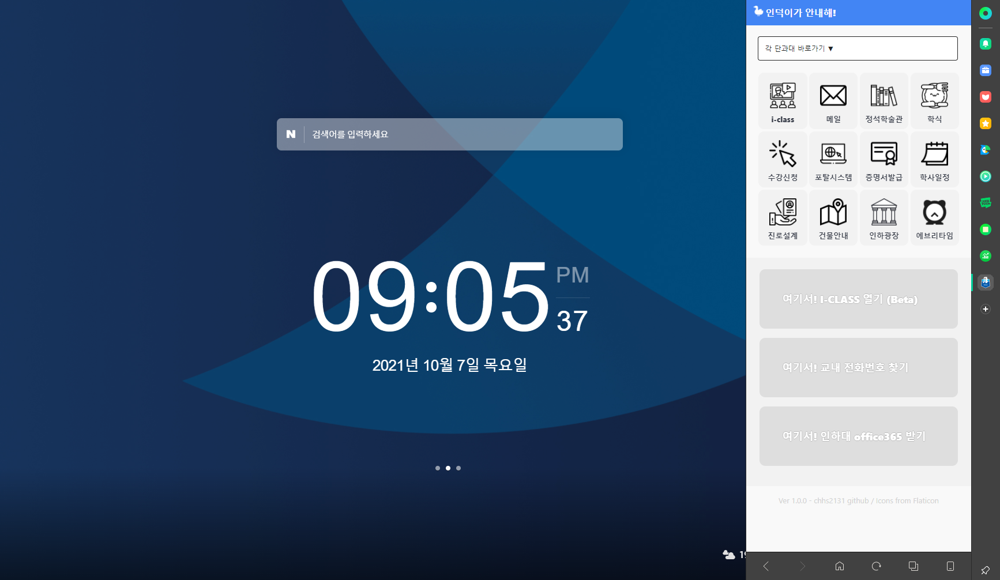
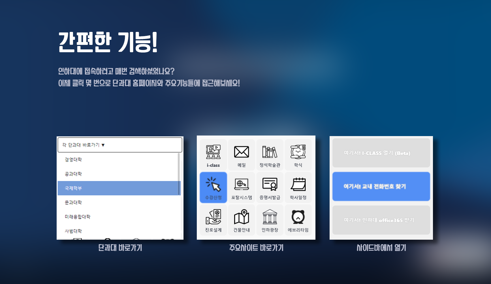
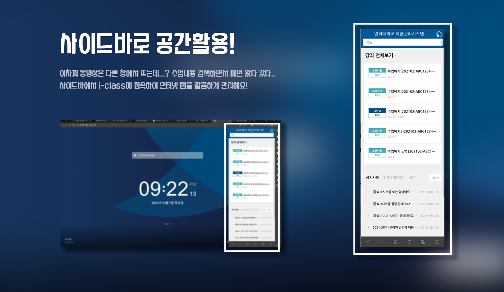
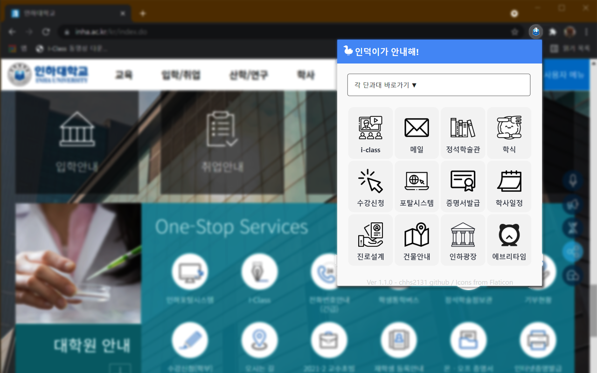

# 🦢 인덕이가 안내해! (induck, guide me!)
웨일 브라우저 확장프로그램으로, 인하대 학생들이 주로사용하는 사이트를 손쉽게 접근하도록 해줍니다.

개발기간 : 2021.10.06 ~ 2021.11.09

  

## 🚀 다운로드

**사이드바(SideBar) 확장프로그램**

- 웨일 스토어 링크 : https://store.whale.naver.com/detail/eijcbpdbabpcihgnfplpcgodepghlebl
- Target Browser : 웨일(whale)
- Version : 1.1.0
- Update : 2021.11.06 (스토어 등록일 2021.11.08)

 

**팝업(POP-UP) 확장프로그램**

- 크롬 스토어 링크 : 심사중
- Target Browser : 웨일(Whale), 크롬(Chrome), 엣지(Edge)
- Version : 1.1.1
- Update : 2021.11.09 (스토어 심사중)

 

 

## 🎪 확장앱 미리보기

 

**사이드바 확장프로그램**

'인덕이가 안내해!' 확장프로그램을 설치하여 사이드바에서 편하게 인하대 관련 사이트들을 이용해보세요!

 

간편한기능! 인하대에 접속하려고 매번 검색하셨나요? 이제 클릭 몇 번으로 단과대 홈페이지와 주요기능들에 접근해보세요!

 

사이드바로 공간활용! 어차피 동영상은 다른 창에서 뜨는데..? 수업내용 검색하면서 매번 왔다 갔다.. 사이드바에서 i-class에 접속하여 인터넷 탭을 깔끔하게 관리해요!

  

**팝업(크롬) 확장프로그램**

브라우저 상단에 아이콘형태로 위치하여 있어 쉽게 접근이 가능하고, 팝업 스타일로 직관적으로 확인, 제어가 가능해요!

  

## 🛠 관련기술

- HTML
- CSS
- JavaScript
- Whale-Browser

  

## 📑 라이센스

Icons made by [Freepik](https://www.freepik.com/) from [Flaticon](https://www.flaticon.com/)

  

## 💡 개발 참고 자료
https://developers.whale.naver.com/tutorials/contextMenu/

드롭다운 메뉴 : https://velog.io/@kauthenticity/HTML-CSS-%EB%93%9C%EB%A1%AD%EB%8B%A4%EC%9A%B4-%EB%A9%94%EB%89%B4-%EB%A7%8C%EB%93%A4%EA%B8%B0

이벤트리스너 : https://javacpro.tistory.com/37
https://opentutorials.org/course/1375/6620
https://developer.chrome.com/docs/extensions/reference/tabCapture/
https://developer.chrome.com/docs/extensions/reference/tabs/

고려대 세종캠퍼스 확장프로그램 : https://github.com/chani017/kurogagi

